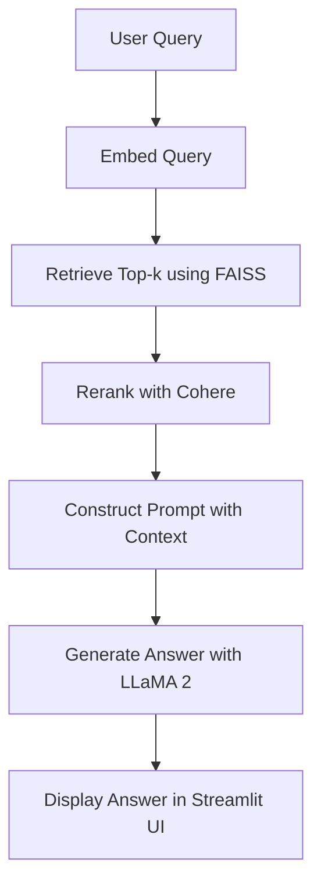

---

# 🧾 TaxMate – RAG-based Tax Law Query Bot

  
  
  


[](https://taxmate-rag.streamlit.app/)

> 📚 A semantic legal assistant built with Retrieval-Augmented Generation (RAG) to simplify access to Indian tax law using open-source LLMs and modern NLP tools.

---

## 🚀 Features

- 🔍 **Semantic Retrieval** using FAISS and MiniLM-SBERT embeddings
- 🔁 **Reranking with Cohere** for improved context precision
- 🧠 **Local Answer Generation** using Meta’s LLaMA 2–7B
- 📊 **Model Evaluation** using BLEU, ROUGE, METEOR, BERTScore, and QuESTEval
- 💡 **User-Controlled Temperature** for tuning creativity
- 🖥️ Built with **Streamlit** for an interactive chat UI

---

## 📌 Technologies Used

| Component | Tool/Library |
|----------|---------------|
| Embeddings | `all-MiniLM-L6-v2` (SBERT) |
| Vector Store | FAISS |
| Reranker | Cohere Rerank API |
| LLM | LLaMA 2–7B (4-bit quantized, local) |
| Frontend | Streamlit |
| Evaluation | BLEU, ROUGE, METEOR, BERTScore, QuESTEval |

---

## ⚙️ Installation

```bash
git clone https://github.com/akasha456/TaxMate.git
cd TaxMate
pip install -r requirements.txt
```

---

## 🧠 How It Works



---

## 📊 Model Evaluation Snapshot

| Model | BLEU | METEOR | ROUGE-1 | BERTScore F1 |
|-------|------|--------|---------|---------------|
| **Mistral AI** | 13.97 | 39.99 | 49.19 | 89.16 |
| **LLaMA 2–7B** | 7.98 | 41.83 | 36.83 | 87.06 |

---

## 📈 Embedding Model Comparison

| Model | Cosine MRR | Recall@5 |
|-------|-------------|-----------|
| MiniLM-SBERT | **1.0000** | **1.0000** |
| BERT | 0.8333 | 1.0000 |
| RoBERTa | 0.7500 | 1.0000 |

---

## 🌐 Future Enhancements

- 🧑‍⚖️ Expand to other domains like **GST** or **Labor Law**
- 📲 Web + Mobile deployment
- 🔔 Integrate real-time updates from government portals
- 🗣️ Voice input/output for accessibility
- 🤖 Fine-tuned LLM on Indian legal corpus

---

## 📜 License

This project is licensed under the MIT License.

---

## 💬 Acknowledgements

- [Meta AI](https://ai.meta.com/llama) for LLaMA 2  
- [Cohere](https://cohere.com) for reranking API  
- [SentenceTransformers](https://www.sbert.net) for embeddings  
- [Streamlit](https://streamlit.io) for the frontend

---


## Screenshots

[](https://postimg.cc/Y4k9WKyT)

